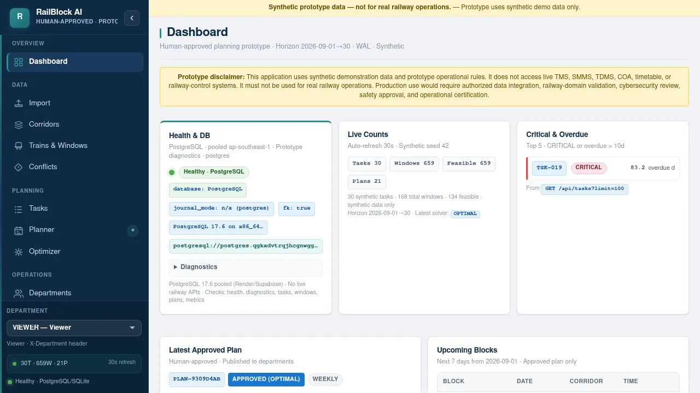
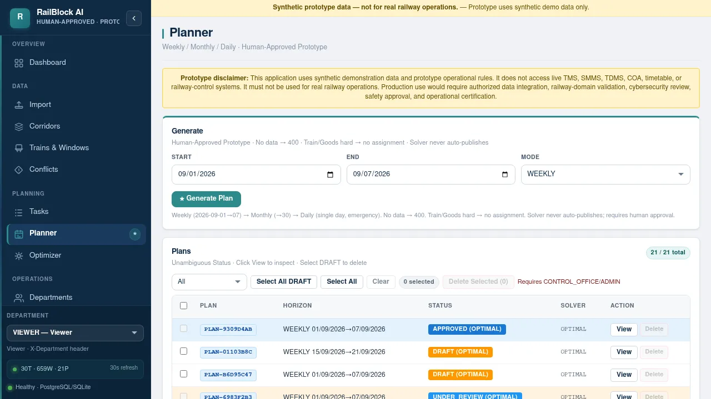

# RailBlock AI — Documentation

> **Human-Approved, Explainable Hybrid AI for Railway Maintenance Planning**
> *Prototype — Synthetic Data Only*

---

## 📚 Index

| Document | Description |
|----------|-------------|
| [Architecture](architecture.md) | System design, stack, and data flow |
| [API Reference](api.md) | All endpoints with examples |
| [Deployment](deployment.md) | Vercel + Voroa + Docker + Supabase |
| [Development](development.md) | Local setup and testing |
| [Demo Evidence](demo-evidence.md) | Live screenshots + API proofs `30T·659W·19P` |
| [Theme — Ocean Depths](theme-factory/theme-showcase.md) | Design system `Navy #0f2a44` `Teal #2d8b8b` |
| [Decisions](grill-with-docs/ADR-001-rust-vs-cpp.md) | Performance architecture (Rust vs C++) |
| [Screenshots](screenshots/) | `10` `webp` `1280×720` live captures |

---

## 🚀 Quick Links

- **Live Frontend:** https://railblock-ai-gamma.vercel.app
- **Backend:** https://railblock-ai.getvoroa.com/health
- **API Docs:** https://railblock-ai.getvoroa.com/docs

---

## 🏗️ At a Glance

**Stack:** `React 18` `Vite 5` `FastAPI 0.110` `SQLAlchemy 2.0` `PostgreSQL 17.6` `SQLite WAL` `OR-Tools CP-SAT` `Recharts`

**Pipeline:** `Synthetic CSV → Import → Priority P=0.30S+… → Windows → CP-SAT 5s → Validator 14 checks → Approve → Execution → Metrics`

See [`architecture.md`](architecture.md) for full diagram.

---

## 📸 Gallery

| Dashboard | Planner |
|-----------|---------|
|  |  |

*Full gallery in [`screenshots/`](screenshots/) — `webp` ~50KB each.*

---

## 📄 License

MIT — see [`LICENSE`](../LICENSE)
