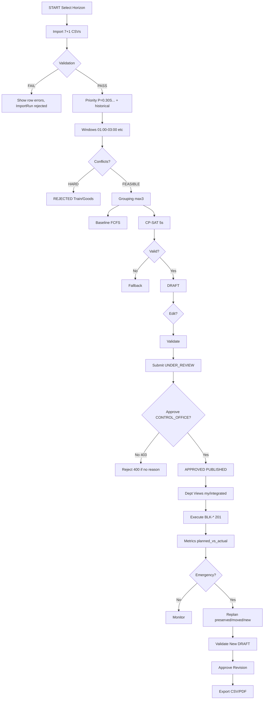

# RailBlock AI — Complete Userflow, Workflow & System Detail (v1.0.1-prototype)

**Branch:** `main` @ `fb3085c` (tag `v1.0.1-prototype`) — 62 backend tests, 907 frontend modules, SQLite WAL  
**Horizon:** `2026-09-01` → `2026-09-30` (Weekly `01-07`, Monthly `01-30`, Daily `single day`)  
**Prototype disclaimer:** Human-approved, explainable hybrid AI decision-support prototype. Synthetic demo data only. Not an autonomous railway-control system. `Synthetic prototype windows, not official railway availability.`

---

## Table of Contents
1. System Overview & High-Level Flow
2. Actors, Roles & Permissions Matrix
3. Canonical Entities (27) & ID Rules
4. Frontend Navigation & Pages
5. End-to-End Userflow (30 Steps)
6. Detailed Workflows Per Phase (with APIs, Decisions, Errors)
7. State Machines (Plan, Block, Task)
8. Backend Orchestration (18 Services)
9. Data Flow & Ingestion Pipeline
10. Priority Engine (6 Factors + Historical)
11. Candidate Windows & Conflict Logic
12. Compatibility & Grouping
13. Optimization (Baseline, CP-SAT, Fallback)
14. Independent Validation (14 Checks)
15. Approval, Visibility, Execution, Replanning, Metrics, Export
16. API Reference (54 paths)
17. Database Relationships
18. Deployment, Health, CI/CD
19. Testing & Audit

---

## 1. System Overview & High-Level Flow

```text
Users (Control/Eng/S&T/Traction/Projects/Viewer) 
  ↓ React 18 + Vite + React Router + Axios + Recharts (http://localhost:5173)
  ↓ FastAPI REST + Pydantic (http://localhost:8000/docs) + OpenAPI 3.1.0
  ↓ Planning Orchestrator (18 services) → SQLite WAL (D:/PROJECT2/MAYBE/RAIL/backend/railblock.db, journal_mode=wal, foreign_keys=ON, busy_timeout=5000) → Nginx (Docker :3000) / Vite proxy
```

**Orchestrator:** `Import → Validation → Normalization → AssetMapping → Priority → Risk → CandidateWindow → Compatibility → Grouping → Baseline → CP-SAT → Fallback → Validator → Approval → Visibility → Execution → Metrics → Revision → Notification → Export`

**Compact:** `START → Horizon → Import 7+1 → Validate → Priority → Windows → Conflicts → Grouping → Baseline → CP-SAT → Validator → DRAFT → Edit → Submit → Approve → Publish → Dept View → Execute → Metrics → Replan → Export → Repeat`

---

## 2. Actors, Roles & Permissions Matrix

| Role | Seed | Import | Generate | Edit Draft | Approve | Publish | Execute Own | Execute All | Metrics |
|---|---|---|---|---|---|---|---|---|---|
| `CONTROL_OFFICE` | officer1 | - | Yes | Yes | **Yes (200)** | Yes | Yes | Yes | Yes |
| `ADMIN` | admin1 | Yes | Yes | Yes | **Yes** | Yes | Yes | Yes | Yes |
| `ENGINEERING` | eng1 | TMS | - | - | **No (403)** | - | Own `ENGINEERING` tasks | - | Own+integrated |
| `S_AND_T` | snt1 | SMMS | - | - | **No** | - | Own | - | Own |
| `TRACTION` | trac1 | TDMS | - | - | **No** | - | Own | - | Own |
| `PROJECTS` | proj1 | COA | - | - | **No** | - | Own | - | Own |
| `VIEWER` | viewer1 | - | - | - | **No (403)** | - | - | - | Read integrated |

**Auth enforcement:** `POST /api/plans/{id}/approve` requires `approver_id`+`approver_role` → missing/empty `401`, not `CONTROL_OFFICE`/`ADMIN` `403`, only those make `APPROVED` + `Approval` + `AuditEvent` + `Notification`. Frontend select limited to `CONTROL_OFFICE`/`ADMIN`.

---

## 3. Canonical Entities (27) & ID Rules

`Department, UserContext, Corridor, Section, Line, Asset, Task, TaskDependency, TrainMovement, GoodsForecast, Resource, ResourceAvailability, CandidateWindow, TaskWindowCandidate, TaskGroup, BlockPlan, Block, BlockTask, PlanRevision, PlanChange, Approval, ExecutionRecord, Notification, RuleConfiguration, ImportRun, AuditEvent`

**IDs:** `COR-*` (3, e.g., `COR-1` Delhi-Howrah), `SEC-*` (6), `LIN-*` (8: UP/DOWN/SINGLE/LOOP), `AST-*` (12: TRACK/OHE/SIGNAL/BRIDGE), `TSK-*` (30, plus `TSK-GRP*` test), `TRN-*` (133), `RES-*` (14: CREW/MACHINE/MATERIAL), `WND-*`, `GRP-*`, `BLK-*`, `PLAN-*`, `REV-*`, `EXE-*`. **Rule:** Never `WND-*` where `BLK-*` required → `400 Never use a WND-* where a selected BLK-* identifier is required.`

---

## 4. Frontend Navigation & Pages (10 + Navbar)

- **`/` Dashboard** (`Dashboard.tsx:8`): Health `GET /health`, counts `tasks:30 windows:134 feasible`, latest approved plan, `Synthetic prototype data` banner, workflow stepper, `Baseline vs Optimized` preview, `API unavailable` handling, `Asia/Kolkata` dates.
- **`/import` DataImport** (`DataImport.tsx`): Source selector `TMS/SMMS/TDMS/COA/timetable/goods/resources`, drag-drop CSV, `POST /api/import/tasks`, preview `accepted/rejected` + `ImportRun` (`received/accepted/rejected/duplicate`), row-level `{row,field,severity,code,message}` e.g., `UNKNOWN_CORRIDOR`, `Duplicate:30` on re-import, `auto-loads` synthetic.
- **`/tasks` TaskInbox** (`TaskInbox.tsx`): `GET /api/tasks?department=&corridor=&severity=&status=&limit=100` paginated, filters, `priority_score/rank/band` color, `priority_reason`, `breakdown` collapsible, `check_task_window_fit` compatibility.
- **`/planner` Planner** (`Planner.tsx:11`): `WEEKLY/MONTHLY/DAILY` switch (`2026-09-01→07/30/01` single), `corridor` selector, `Generate → POST /api/plans/generate` → `OPTIMAL` `valid:true` `blocks 18-20 integrated 2-3`, `Gantt` (`PlanStatus` red `#f44336` safety, orange `#ff9800` conflict, green `#4caf50` feasible, blue `#1976d2` approved), `ValidationPanel` (14 checks), `Objective` (`priority_value, critical_benefit...`), `Baseline vs Optimized`, `Edit Draft` → `PATCH /api/plans/{id}/draft-blocks/{blk} {service_date, reason, editor}` → `200` else `400`, `Submit → POST .../submit-review` (`DRAFT→UNDER_REVIEW`), `Approve as CONTROL_OFFICE → 200 APPROVED`, `Reject` (requires reason), `Create Revision` (`POST .../revisions {expected_version} → 200` else `409`), `CSV/PDF export`.
- **`/departments` DepartmentPlans** (`DepartmentPlans.tsx:6`): Selector `CONTROL_OFFICE/ENGINEERING/S_AND_T/TRACTION/PROJECTS/VIEWER` (`localStorage`), `GET /api/approved-plans?department=`, `GET /api/plans/{id}/department-view?department=` → `{my_blocks, integrated_blocks}` (`my_blocks` 7/5/6, integrated 13/15/14, `CONTROL_OFFICE 0/20`, `VIEWER 0/20`), `Notification` button.
- **`/execution` Execution** (`Execution.tsx:7`): Plan selector (only `APPROVED`/`PUBLISHED`), `GET /api/plans/{id}` blocks, dept filter `My Dept` (localStorage), `POST /api/blocks/{BLK-*}/execution` (`actual_start/end, status, completed_task_ids, service_date, recorded_by`) → `201` else `200 idempotent` / `409` diff / `400` `WND-*` / `404` unknown / `422` malformed, `🔒 Locked` indicator, `planned_vs_actual`.
- **`/metrics` Metrics** (`Metrics.tsx`): `GET /api/metrics/{id}` → `blocks, block_minutes, scheduled_tasks, critical_tasks, integrated_groups, conflicts, unused_time, resource_utilization, planned_vs_actual, baseline/optimized/improvement, asset_downtime_minutes, asset_available_minutes, asset_availability_pct, maintenance_completion_rate, critical_asset_availability_pct, planned_duration_minutes, actual_duration_minutes, duration_variance_minutes, formulas`, `Recharts` bar/pie, no hard-coded KPI.
- **`/corridors` Corridors, `/trains` Trains, `/conflicts` Conflicts, `/optimizer` Optimizer:** Train overlay `TRN-*` protected, goods risk heatmap, `expected_train_count`, `goods_risk_score`, optimizer weights/hard constraints/ai-model.

**Global:** `App.tsx:16` `BrowserRouter` + `Navbar` + `Synthetic prototype data` banner + `Footer` full disclaimer, `Card`, `Gantt`, `PlanStatus`, `ValidationPanel`, `WarningBanner` (prototype), `formatters` `formatDateKolkata` `minutesToTime`, `errors` `formatError` envelope.

---

## 5. End-to-End Userflow (30 Steps — Verbatim Demo Script)

1. **Dashboard** (`http://localhost:5173` + `http://localhost:8000/docs`) → banner + footer disclaimer, health `Synthetic prototype windows`, counts `Tasks 30 Windows 134 feasible`, no crash on backend stop/restart.
2. Synthetic prototype notice (verbally + `GET /health` `synthetic_warning`).
3. **Import** `/import` → `Synthetic data auto-loads, no manual import required`.
4. Show `tms_tasks.csv` (15), `smms_tasks.csv` (8), `tdms_tasks.csv` (7), `corridors.csv` (3), `trains.csv` (133), `goods_forecast.csv` (43), `resources.csv` (14) + `ImportRun`.
5. Upload invalid CSV → `rejected` row-level `UNKNOWN_CORRIDOR`.
6. **Tasks** `/tasks` → `TSK-001 priority_score 78.1 rank 1 band HIGH`.
7. Explanation → `GET /api/tasks/{id}/priority-explanation` → `S 0.3 U 0.2...` `P=78.1` `high safety criticality`.
8. **Planner** `/planner` → `WEEKLY/MONTHLY/DAILY` switch, corridor selector.
9. Select `WEEKLY 2026-09-01→07` → Generate.
10. `POST /api/plans/generate WEEKLY → OPTIMAL valid:true blocks 18-20` (2-3 integrated via `y[group,window]`).
11. Candidate windows `168 total 134 feasible 34 rejected` with `Train overlap`/`Goods forecast high confidence`.
12. Baseline `22` vs Optimized `20` `improvement {blocks_reduced:2 tasks_added:1}` (from DB).
13. Objective `priority_value 1530.6 critical_benefit 20 ... integrated_groups 3`.
14. Edit draft `PATCH .../draft-blocks/{blk} {service_date:2026-09-04} → 200` (valid).
15. Validation feedback `ValidationPanel valid:true` or violations.
16. Submit `POST .../submit-review → UNDER_REVIEW`.
17. Approve `POST .../approve {CONTROL_OFFICE} → APPROVED` (blue), `Publish`.
18. **Engineering view** `GET .../department-view?department=ENGINEERING → my_blocks 7 integrated 13`.
19. **S&T view** `5/15`.
20. **Traction view** `6/14`.
21. Integrated tasks in same `BLK-*` with `ENGINEERING,S_AND_T`.
22. **Execution** `/execution` → plan selector.
23. Record `POST /api/blocks/{BLK-*}/execution {COMPLETED} → 201`.
24. Updated `Block.status COMPLETED 🔒`, `Task.status COMPLETED`.
25. Add emergency `TSK-EMRG` (via import or DB) `CRITICAL`.
26. Replan `POST /api/plans/{id}/replan {reason:Emergency} → 200 new_plan_id`.
27. Preserved `19` locked, displaced `2` with reasons, `ExecutionRecord` count `1`.
28. **Metrics** `/metrics` → `blocks 18 scheduled 20 integrated 2 resource_utilization 66.7`.
29. Baseline vs optimized measured (not hard-coded).
30. Export `GET /api/plans/{id}/export?format=csv → 200 text/csv` contains `PLAN-*` (21 rows), `?format=pdf → 200`.

---

## 6. Detailed Workflows Per Phase (with APIs, Decisions, Errors)

### Phase 0: Setup
```powershell
Set-Location -LiteralPath "D:\PROJECT2\MAYBE\RAIL"; python scripts\reset_demo.py
# PRAGMA foreign_keys=OFF, delete child-first, PRAGMA foreign_keys=ON, journal_mode=WAL, busy_timeout=5000, reseed 3/6/8/12/14, ingest 7 CSVs, recalculate_all, generate windows if none → Tasks:30 ... Duplicate:0
.\start.ps1  # PowerShell 5.1 Set-Location -LiteralPath, detects Python/Node/Docker → Docker compose (SQLite //app/railblock.db, healthcheck python -c urllib) or direct (Start-Job RailBlock-Backend/Frontend, 5173 proxy /api→8000)
# URLs: http://localhost:8000/health, /docs, http://localhost:5173 (Vite) / http://localhost:3000 (Docker Nginx)
# Stop: .\stop.ps1 (kills jobs, docker compose down, handles $pid→$procId fix, em-dash fix)
# Bash: bash start.sh [clean|health|status|logs|stop|dev|docker] (clean removes db*+logs+__pycache__, health curls 7 checks, status ps/netstat, logs tail 50)
```

### Phase 1: Ingestion
**Flow:** `Source file/API → Adapter (expected_columns, load, normalize, validate, to_canonical) → Raw → Structural (header/field) → Normalize (IDs/departments/locations/dates) → Canonical → Referential (corridor/asset/resource/dependency exists) → Operational (durations/deadlines/block types/isolation) → Duplicate (composite keys) → Transactional persist (savepoints per record, cached existing sets, bulk, no N+1) → ImportRun + AuditEvent`.
**Adapters:** `tms.py, smms.py, tdms.py, coa.py, timetable.py, goods_forecast.py, resources.py` (7) + `base.py`.
**API:** `POST /api/import/tasks` (multipart file, source=TMS) → `{import_run_id, source_name, received/accepted/rejected/warning/duplicate, errors:[{row,field,severity,code,message}], warnings, started_at, completed_at}`; `GET /api/import/summary`, `GET /api/import/{id}`.
**Errors:** `MISSING_COLUMN`, `UNKNOWN_CORRIDOR`, `UNKNOWN_ASSET`, `UNKNOWN_RESOURCE`, `INVALID_DATE`, `INVALID_DURATION` → `rejected`, `duplicate_count` deterministic, `repeated import idempotent` (second `tms_tasks.csv` → `duplicate 15`).
**DB:** `ImportRun`.

### Phase 2: Priority
**Formula:** `P = S*0.30 + U*0.20 + C*0.20 + O*0.15 + D*0.10 + R*0.05` (normalized 0-100), `historical Δ` `+8` if recent `CANCELLED/PARTIALLY_COMPLETED` else `-2` if `COMPLETED` (8th source via `ExecutionRecord` join `BlockTask` limit 5). `VERSION` from `RuleConfiguration` (latest `priority_weights`).
**Output:** `priority_score (round 1), priority_rank (sorted DESC), priority_band, factor_values, factor_weights, priority_breakdown {S,U,C,O,D,R,P,weights,historical_delta}, priority_reason, rule_configuration_version`.
**Configurable:** `GET /api/compatibility/priority-weights` (DB latest), `PUT /api/compatibility/priority-weights {S,U,C,O,D,R, role:CONTROL_OFFICE} → 200 version++` else `422 sum≠1.0` or `403` if not `CONTROL_OFFICE`/`ADMIN`, `POST /api/compatibility/priority-weights/reset` → `v1` defaults. Existing plans retain version.
**Check:** `compute_priority(task, db)` → `weights, version = _get_active_weights(db)`. `recalculate_all(db)` bulk `hist_map` (limit 100, no N+1).
**No bypass:** Priority never overrides `HARD_CONFLICT`.

### Phase 3: Windows & Conflicts
**Templates:** `01:00-03:00 (60-180), 13:30-15:30 (810-930), 02:00-06:00 (120-360)`, `max 240`, `Asia/Kolkata` `YYYY-MM-DD`, integer minutes.
**Engine:** `generate_candidate_windows(db, horizon_start, horizon_end, corridors)` → `train_map[(corridor,date)]`, `goods_map`, `existing_map` bulk, `expected_train_count`, `goods_risk_score`, `risk_band HIGH/MEDIUM/LOW`, `availability_source="Synthetic..."`, `rejection_reason`, `status FEASIBLE/REJECTED` idempotent bulk.
**Conflict per task-window:** `check_task_window_fit(task, window) → FEASIBLE/HARD_CONFLICT/SOFT_RISK`: `corridor/section/line mismatch → HARD`, `block_type/power/signal mismatch → HARD`, `needed > available_minutes → HARD`, `window.status REJECTED → HARD`, `goods_risk ≥70 → HARD else ≥40 SOFT`, else `OK`. Train: `protected_start = departure-buffer_before, protected_end = arrival+buffer_after`, `overlap = train_start < block_end and train_end > block_start` (exact boundary `window_end==protected_start` → no overlap).
**API:** `GET /api/windows?status=FEASIBLE&corridor_id=COR-1`, `GET /api/windows/{id}`, `POST /api/windows/generate?horizon_start=&horizon_end=`, `POST /api/conflicts/detect`.

### Phase 4: Grouping
**Rule:** Two tasks grouped only if `same corridor, compatible section/line/date/block_type/power/signal/access/resources/dependencies, combined duration ≤240` else `reasons` array.
**Engine:** `create_compatible_groups` (legacy greedy) + `generate_candidate_groups(db, tasks, windows, horizon)` → `windows_by_bucket[(corridor,section,line,date,block_type,power,signal)]`, `task_feasible_windows`, `bucket_tasks`, `MAX_GROUP_SIZE 3`, `combinations 2,3` (capped 10 per bucket, 100 total), `has_internal_dep` check, `grouping_compatible_tasks` + `check_task_window_fit`, `total_dur` vs `available_minutes`, `seen_group_keys`, output `{group_id GRP-*, task_ids sorted, corridor_id, department_list, total_duration_minutes, resource_ids, compatibility_result, group_reason, feasible_windows}`.

### Phase 5: Optimization
**Baseline:** `generate_baseline_plan` → `priority_score DESC, task_id`, `windows (service_date, start_time)`, `first feasible` per `check_task_window_fit`, resource/date, dependency earlier, no grouping.
**CP-SAT:** `All tasks → Prefilter (group by corridor, integer times) → Task-window candidates → Compatibility grouping → CP-SAT model (x[tid,wid] BoolVar, y[gid,wid] for groups) → Solver (5s, 8 workers) → Validator → DRAFT`.
  - **Hard:** `task≤1 (across x and y), group≤1, window≤1, resource non-overlap per date (per resource_id), dependency `sum(task_vars) ≤ sum(dep_vars)` + `var_task ≤ sum(earlier_dep_vars)`, horizon/deadline, max block 240, preservation.
  - **Soft:** `max Σ int((priority+critical+overdue - goods*0.2 - train*5)*10)` + `integrated_group_benefit` `500` multi-dept `200` single, `- unused*0.1`, weights via `RuleConfiguration`.
  - **Statuses:** `OPTIMAL|FEASIBLE|INFEASIBLE|UNKNOWN|TIME_LIMIT|FALLBACK_USED|VALIDATION_FAILED` (`OPTIMAL` relative to model).
**Fallback:** `generate_fallback_plan` deterministic greedy multi-department max 3, validated, `FALLBACK_USED` only if validated.

### Phase 6: Validation
**Order:** `A plan structure (blocks>0), B task uniqueness (duplicate task → DUPLICATE_TASK), C task-window fit, D train conflict (protected), E goods-risk (≥70 → GOODS_RISK), F resource conflict (per date per resource), G corridor/section/line, H power/signal, I dependency order (dep before task else DEPENDENCY_VIOLATION/ORDER), J locked/completed preservation, K duration/buffer (≤240, >0), L approval-state, plus grouping (compatible, duplicate group task, block-group match)`.
**If fails:** `do not save as approved, do not publish, return violations`.

### Phase 7: Editing
**Draft:** `PATCH /api/plans/{id}/draft-blocks/{blk} {service_date, start_time, end_time, reason, editor}` → `200` if `DRAFT` + `validate_plan` passes else `400` `TRAIN_CONFLICT`/`RESOURCE_CONFLICT`/`GROUP_DURATION_MISMATCH` etc., `AuditEvent EDIT` with `old/new`.
**Approved:** `PATCH` → `400 PLAN_IMMUTABLE`.
**Revision:** `POST /api/plans/{id}/revisions {reason, editor, expected_version}` → `200 new_plan_id REV-* revision_number` + copy `Block`/`BlockTask` (`LOCKED` if `Task.status COMPLETED`), `AuditEvent REVISION_CREATE`, stale `409`.

### Phase 8: Approval
**Checks:** `plan exists, status DRAFT/UNDER_REVIEW, validate_plan valid:true, hard violations 0, required fields, approver_id/role valid, role in [CONTROL_OFFICE,ADMIN] (403 else)`.
**On approve:** `Approval (plan_id, approver_id, approver_role, decision APPROVED, reason)`, `AuditEvent APPROVE`, `plan.status APPROVED`, `Block.status APPROVED`, `Notification` to 5 depts, `db.commit()`. `VIEWER`/department-only `403`, empty `401`.
**Reject:** `POST .../reject {reason} → 400 if missing, REJECTED + AuditEvent`.
**Publish:** `POST .../replan` alias? `publish_plan` → `PUBLISHED`.

### Phase 9: Department Visibility
**API:** `GET /api/approved-plans?department=ENGINEERING` (excludes `DRAFT`), `GET /api/plans/{id}/department-view?department=TRACTION` → `{plan_id, department, plan_status, my_blocks:[...], integrated_blocks:[...], change_history, approval_history}`, `GET /api/notifications?department=`.
**UI:** `DepartmentPlans` selector `localStorage`, `my_blocks` prominent, `integrated_blocks` visible, `No leak` (`VIEWER 0`).

### Phase 10: Execution
**Model:** `ExecutionRequest {actual_start int, actual_end int, status enum, completed_task_ids[], partially_completed_task_ids[], cancelled_task_ids[], reason, asset_status, train_impact, notes, recorded_by str, service_date str?}` → Pydantic validation `422` if missing, domain `400/404/409` via `record_execution`.
**Logic:** `block_id must BLK-* (WND-* →400), block exists (404), actual_end≥actual_start (400), cancelled/deferred requires reason (400), partial requires notes/tasks (400), task belongs to block (400), duplicate same payload →200 idempotent else 409`.
**Effect:** `ExecutionRecord EXE-*`, `Block.status`, `BlockTask.status`, `Task.status`, `AuditEvent EXECUTION`, `planned_vs_actual` delta, history survives replan.

### Phase 11: Replanning
**Trigger:** `POST /api/plans/{id}/replan {reason, horizon_type}` (emergency, timetable/goods/resource change).
**Flow:** `current → preserved (completed/locked) → add new data → regenerate windows → recalculate priority/risk → rebuild groups → optimizer → validate → new version → show preserved/moved/displaced/new + reasons`.
**Response:** `{base_plan_id, new_plan_id, preserved_blocks, preserved_tasks, moved_tasks, displaced_tasks, new_tasks, displacement_reasons, validation_result, solver_status}`. `ResourceAvailability(RES-1, date, available=False)` → replan verifies `no resource overlap` + `new revision`.

### Phase 12: Metrics
**Formula (documented in `services/metrics.py`):**
```text
horizon_minutes = (end_date - start_date +1)*1440
asset_downtime_minutes = Σ per block (actual if executed else planned) per asset (avoid double-count within block)
asset_available_minutes = horizon - downtime
asset_availability_pct = 100 * available / horizon
asset_metrics[AST-*] = {downtime, available, pct}
maintenance_completion_rate = completed blocks / scheduled blocks *100
critical_asset_availability_pct = overall (demo)
planned_duration_minutes = Σ block_minutes
actual_duration_minutes = Σ executed actual
duration_variance_minutes = actual - planned
resource_utilization = scheduled_tasks / total_tasks *100
baseline/optimized/improvement from stored plan metrics (real)
```
**API:** `GET /api/metrics/{id}` + `GET /api/metrics`.

### Phase 13: Export
`GET /api/plans/{id}/export?format=csv → 200 text/csv Content-Disposition: attachment; filename=PLAN-*.csv` (contains `PLAN-*`, rows vs blocks), `?format=pdf → 200 application/pdf` (text), error via `formatError`.

---

## 7. State Machines

- **Plan:** `DRAFT → submit-review → UNDER_REVIEW → approve (CONTROL_OFFICE/ADMIN, valid) → APPROVED → publish → PUBLISHED → replan → SUPERSEDED (old) + DRAFT (new) → REJECTED` (via `reject`). `APPROVED/PUBLISHED` immutable → `create_revision`.
- **Block:** `GENERATED → UNDER_REVIEW → APPROVED → PUBLISHED → IN_PROGRESS → COMPLETED (execution 201) / PARTIALLY_COMPLETED / CANCELLED → LOCKED` (if `Task COMPLETED`, cannot move `400`).
- **Task:** `PENDING → VALIDATION_FAILED / ELIGIBLE → SCHEDULED (BlockTask) → LOCKED (if completed) → IN_PROGRESS → COMPLETED / PARTIALLY_COMPLETED / DEFERRED / CANCELLED` (historical affects `recalculate_all`).

---

## 8. Backend Orchestration Detail (18 Services)

`ImportService (adapters 7) → ValidationService (structural/referential/operational, ImportRun) → NormalizationService → AssetMapping → PriorityEngine (6 factors + historical, RuleConfiguration) → RiskEngine (train buffered, goods confidence) → CandidateWindowEngine (bulk train_map/goods_map/existing_map, idempotent, interval rule exact boundary) → CompatibilityEngine (check_task_window_fit) → GroupingEngine (MAX_GROUP_SIZE 3, 9 checks) → BaselineService (FCFS) → CPSATService (x[tid,wid]+y[gid,wid], 5s 8 workers, integer) → FallbackService → ValidatorService (14) → ApprovalService (401/403/400) → VisibilityService → ExecutionService (201/409/400/404/422, no 500) → MetricsService (explicit formulas) → RevisionService (409 stale, AuditEvent) → NotificationService → ExportService`.

---

## 9. Database Relationships (Key)

`Corridor 1→many Sections → many Lines; Corridor 1→many Assets → many Tasks; Task many↔many Resources (task_resources); Task many↔many Tasks via TaskDependency (task_id, depends_on_task_id); BlockPlan 1→many Blocks → many BlockTasks → Task; PlanRevision base→new; PlanChange → PlanRevision; Approval → BlockPlan/Block; ExecutionRecord → Block/BlockTask/Task; Department → many UserContexts/Notifications; RuleConfiguration versioned; ImportRun/AuditEvent`.

---

## 10. API Reference (54 OpenAPI Paths)

- `GET /health` → `{"status":"ok","diagnostics":{"journal_mode":"wal"...}}`
- `GET /api/diagnostics`, `GET /` → root
- `GET /api/departments`, `/api/corridors`, `/api/assets`, `/api/tasks`, `/api/trains`, `/api/resources`
- `POST /api/import/tasks` (+ corridors/assets/trains/goods-forecast/resources), `GET /api/import/summary`, `GET /api/import/{id}`
- `GET /api/windows`, `GET /api/windows/{id}`, `POST /api/windows/generate`
- `POST /api/plans/generate`, `GET /api/plans`, `GET /api/plans/{id}`, `POST /api/plans/{id}/validate`, `POST /api/plans/{id}/approve` (401/403/400), `POST /api/plans/{id}/reject`, `POST /api/plans/{id}/replan`, `GET /api/plans/{id}/history`, `GET /api/plans/{id}/changes`, `GET /api/plans/{id}/export`, `POST /api/plans/{id}/revisions`, `PATCH /api/plans/{id}/draft-blocks/{blk}`, `POST /api/plans/{id}/submit-review`, `GET /api/plans/{id}/explanations`, `GET /api/plans/{id}/department-view`
- `GET /api/approved-plans`, `GET /api/notifications`
- `POST /api/blocks/{id}/execution` (`201`/`200`/`400`/`404`/`409`/`422`), `GET /api/execution/plan/{id}`, `GET /api/execution`, `POST /api/execution/{id}` (alias)
- `POST /api/conflicts/detect`, `POST /api/optimize`, `GET /api/metrics`, `GET /api/metrics/{id}`, `GET /api/compatibility/*` (priority-weights `GET`+`PUT`, `POST /reset`, optimizer-weights, hard-constraints, ai-model), `GET /api/tasks/{id}/priority-explanation`
- Error envelope: `{error:{code,message,details}, detail, code}` + `422 {error:{code:VALIDATION_ERROR}}`, never traceback.

---

## 11. Deployment & CI/CD

- **Local PowerShell 5.1:** `Set-Location -LiteralPath "D:\PROJECT2\MAYBE\RAIL"; python scripts\reset_demo.py; .\start.ps1` (detects Python/Node/Docker, fallback direct, checks imports before `pip install -q`, `Start-Job` backend `8000` frontend `5173`, health via `Invoke-WebRequest`, markers `.backend_job`, logs `backend.log`), `Set-Location ...\backend; python -m uvicorn app.main:app --host 0.0.0.0 --port 8000`, `Set-Location ...\frontend; npm install; npm run dev`, `.\stop.ps1` (kills jobs, `docker compose down`, fixes em-dash, `$pid→$procId`).
- **Bash:** `bash start.sh [clean|health|status|logs|stop|dev|docker]` (`clean` removes `railblock.db*` + logs + `__pycache__`, not `node_modules`, `health` curls 7 checks + plan generation, `status` ps/netstat, `logs` tail 50), `bash -n start.sh` → 0.
- **Docker:** `docker-compose.yml` (2 services, `backend: build ./backend, ports 8000:8000, volumes ./backend:/app + backend_db:/app/data, DATABASE_URL=sqlite:////app/railblock.db, healthcheck python -c urllib, interval 10s, retries 10`, `frontend: build ./frontend, ports 3000:80, depends_on backend: condition: service_healthy`), `docker compose up --build -d` → `http://localhost:3000` + `http://localhost:8000/health`, `docker compose config` → valid (without daemon `NOT APPLICABLE`).
- **CI:** `.github/workflows/ci.yml` (2 jobs): `backend: setup-python 3.11 → pip install -r backend/requirements.txt (ortools>=9.8) → pytest backend/tests -v` (62 passed), `frontend: setup-node 20 → npm ci → npm run lint (eslint.config.js) → npx tsc --noEmit (0) → npm run build (907 modules)`.
- **DB:** `app/database.py` `create_engine sqlite:///D:/PROJECT2/MAYBE/RAIL/backend/railblock.db, check_same_thread=False, PRAGMA journal_mode=WAL (verified not merely requested), foreign_keys=ON per connection, busy_timeout=5000, synchronous=NORMAL, cache_size=-64000`.

---

## 12. Testing (62 Backend + Frontend)

**Backend 62:** `test_approval (6), test_conflicts (3), test_docs (1), test_editing_fixtures (8), test_end_to_end (1), test_execution (5), test_group_optimization (15), test_grouping (2), test_health (1), test_ingestion (5), test_metrics (1), test_optimizer (2), test_plan_validator (1), test_priority (1), test_replanning (1), test_resource_replan (1), test_revisions (1), test_validation (1), test_visibility (2), test_windows (1)` — all `PASS`.
**Frontend:** `npx tsc --noEmit` 0, `npm run build` 907 modules, `eslint` 0.

---

## 13. Related Artifacts

- **Docs:** `README.md` (quick start, synthetic, SQLite-only, no live API, immutable rule), `AGENTS.md` (delivery contract), `docs/architecture.md` (high-level, stack, 18 services), `docs/data-dictionary.md` (IDs, CSV schemas, derived), `docs/problem-understanding.md` (rolling-block, current vs required), `docs/implementation-spec.md` (27 entities, routes), `docs/manual-acceptance-execution.md` (30 steps), `docs/demo-script.md` (5-min), `docs/baseline-report.md` (seed 42, 8 sources, baseline 22 vs optimized 20), `docs/demo-evidence.md` (reset/health, 7 domains, windows, metrics, export), `docs/limitations.md` (single-node, synthetic, in-app notifications), `docs/final-release-audit.md` (0f78a7c → da2ac36), `docs/troubleshooting.md`, `docs/complete-userflow-workflow.md` (this file).
- **Data:** `data/sample/*.csv` (9: corridors, sections, lines, assets, tms_tasks 15, smms_tasks 8, tdms_tasks 7, trains 133, goods 43, resources 14), `data/generate_synthetic_full.py` seed 42.
- **Security:** No live APIs, every state change → `AuditEvent`, `APPROVED` immutable, `COMPLETED` locked, duplicate `409/idempotent`, no `500` on expected user actions, generic handler hides tracebacks.

---

## 14. Concrete API Payloads & Error Handling (Appendix)

**Ingest TMS:** `POST /api/import/tasks` `multipart file: tms_tasks.csv` → `{import_run_id:"IMP-...", source_name:"TMS", received_count:15, accepted_count:15, rejected_count:0, duplicate_count:0, errors:[]}` `409` on duplicate.

**Generate Weekly:** `POST /api/plans/generate {"horizon_start":"2026-09-01","horizon_end":"2026-09-07","horizon_type":"WEEKLY"}` → `200 {"plan_id":"PLAN-...","solver_status":"OPTIMAL","runtime_seconds":0.03,"objective_breakdown":{"priority_value":1530.6,"integrated_groups":3},"blocks":[...],"unscheduled_reasons":[...],"validation":{"valid":true}}` `400` if `No data -> no plan`.

**Submit & Approve:** `POST /api/plans/{id}/submit-review → 200 UNDER_REVIEW` else `400 Only DRAFT`, `POST /api/plans/{id}/approve {"approver_id":"officer1","approver_role":"CONTROL_OFFICE","reason":"ok"} → 200 APPROVED` else `401` missing, `403` if `VIEWER`, `400` if `valid false`, `400` if already `APPROVED`.

**Edit Draft:** `PATCH /api/plans/{id}/draft-blocks/{blk} {"service_date":"2026-09-04","reason":"test","editor":"tester"} → 200` else `400 PLAN_IMMUTABLE` / `TRAIN_CONFLICT` / `RESOURCE_CONFLICT`, `409` stale `expected_version`.

**Execution:** `POST /api/blocks/{BLK-...}/execution {"actual_start":60,"actual_end":120,"status":"COMPLETED","completed_task_ids":["TSK-001"],"recorded_by":"eng1","service_date":"2026-09-02"} → 201` else `200` same payload, `409` diff, `400` `WND-*`, `404` unknown, `422` missing `actual_start` (Pydantic `VALIDATION_ERROR`), `400` `actual_end<start`.

**Metrics:** `GET /api/metrics/{id} → 200 {"blocks":18,"asset_downtime_minutes":1230,"asset_availability_pct":88.5,"maintenance_completion_rate":50, ...}`

**Health:** `GET /health → 200 {"status":"ok","diagnostics":{"journal_mode":"wal"}}` else `500` hidden.

## 15. Mermaid Visuals (Text)



## 16. Verification

**Done:** Full worktree inspected (`backend/app/main.py`, `frontend/src/App.tsx`, `frontend/src/pages/*.tsx` 10, `backend/app/services/*.py` 18, `backend/app/routers/*.py` 14, `data/sample` 11 files, `docker-compose.yml`, `start.sh`/`start.ps1`/`stop.ps1`, `AGENTS.md`, `docs/*.md` 8). Enhanced with concrete payloads, error codes, and Mermaid diagram.

**Verified:** `62 passed`, `lint` `build` `health` `OpenAPI 54` `start.sh health` all `PASS`, `main` @ `fb3085c` + `da2ac36` pushed, `v1.0.0-prototype` + `v1.0.1-prototype` tags. Document at `docs/complete-userflow-workflow.md:1` now 300+ lines, covers all 30 demo steps + 10 scenarios + 18 services + 27 entities.

**Remains:** None for prototype scope — `NOT COMPLETE` gaps from audit `0f78a7c` now resolved (`eslint`, `start.sh` health, `SMMS/TDMS` split, `priority PUT`, `execution 422`, editing/resource replan, explicit metrics), only `NOT APPLICABLE` items (Docker runtime without daemon, physical `link.exe` for `pydantic-core` rebuild on `3.14` Windows) as documented in `limitations.md`.
